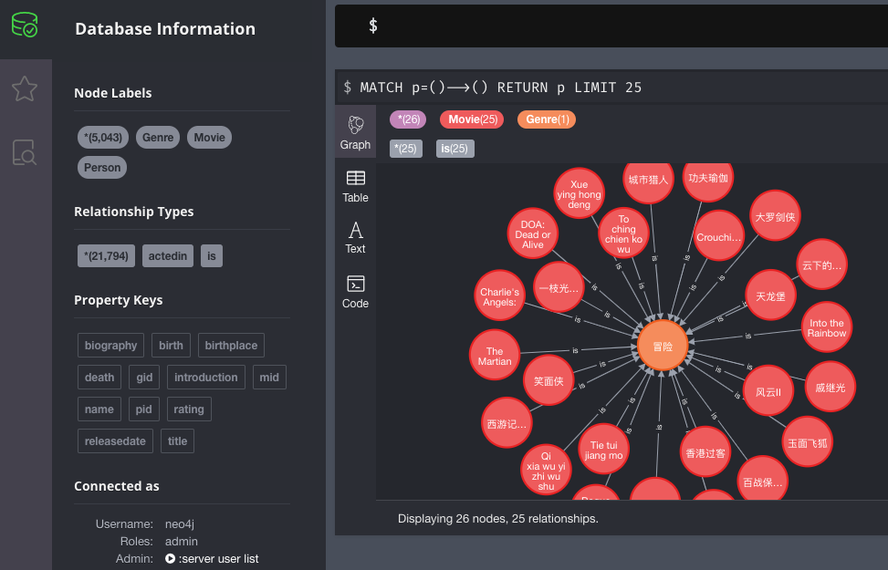

## 知识图谱篇

#### 知识库的构建

##### 一. 准备数据

[genre.csv](./movie_data/genre.csv) 用于记录所有电影的类别

| gid  | gname |
| ---- | ----- |
| 12   | 冒险  |
| 14   | 奇幻  |
| ...  | ...   |

[person.csv](./movie_data/person.csv) 用于记录所有演员的信息

| pid    | birth      | death      | name   | blography                           | birthplace                         |
| ------ | ---------- | ---------- | ------ | ----------------------------------- | ---------------------------------- |
| 643    | 1965-12-31 | \N         | 巩俐   | 新加坡华裔女演员，祖籍中国山东，... | Shenyang, Liaoning Province, China |
| 695    | 1937-03-16 | 1999-04-14 | 乔宏   |                                     | Shanghai, China                    |
| ...... | ......     | ......     | ...... | ......                              | ......                             |

[movie.csv](./movie_data/movie.csv) 用于记录所有电影的信息

| mid    | title             | introduction                                                 | rating       | releasedate |
| ------ | ----------------- | ------------------------------------------------------------ | ------------ | ----------- |
| 13     | Forrest Gump      | 阿甘（汤姆·汉克斯 Tom Hanks 饰）于二战结束后不久出生在美国南方...... | 8.3000001907 | 1994-07-06  |
| 24     | Kill Bill: Vol. 1 | 新娘（乌玛·瑟曼饰）曾经是致命毒蛇暗杀小组（D．I．V．A．S）的一员...... | 7.8000001907 | 2003-10-10  |
| ...... | ......            | ......                                                       | ......       | ......      |

[person_to_movie.csv](./movie_data/person_to_movie.csv) 用于记录所有电影的参演人员的 关系信息 1对N

| pid    | mid    |
| ------ | ------ |
| 163441 | 13     |
| 240171 | 24     |
| ...... | ...... |

[movie_to_genre.csv](./movie_data/movie_to_genre.csv) 用于记录所有电影 是什么类型 关系信息 1对N

| mid    | gid    |
| ------ | ------ |
| 79     | 12     |
| 82     | 12     |
| ...... | ...... |

##### 二. 导入数据

下载图数据库: [neo4j官网](https://neo4j.com/)

将五个数据文件移动至 neo4j 目录下的 import目录中

启动neo4j, 打开浏览器并访问 [http://localhost:7474/](http://localhost:7474/)

在命令行输入栏导入数据

1. 导入[genre.csv](./movie_data/genre.csv) 用于记录所有电影的类别

   ```sql
   //导入节点 电影类型  == 注意类型转换
   LOAD CSV WITH HEADERS  FROM "file:///genre.csv" AS line
   MERGE (p:Genre{gid:toInteger(line.gid),name:line.gname})
   ```

2. 导入[person.csv](./movie_data/person.csv) 用于记录所有演员的信息

   ```sql
   LOAD CSV WITH HEADERS FROM 'file:///person.csv' AS line
   MERGE (p:Person { pid:toInteger(line.pid),birth:line.birth,
   death:line.death,name:line.name,
   biography:line.biography,
   birthplace:line.birthplace})
   ```

3. 导入[movie.csv](./movie_data/movie.csv) 用于记录所有电影的信息

   ```sql
   LOAD CSV WITH HEADERS  FROM "file:///movie.csv" AS line  
   MERGE (p:Movie{mid:toInteger(line.mid),title:line.title,introduction:line.introduction,
   rating:toFloat(line.rating),releasedate:line.releasedate})
   ```

4. 导入[person_to_movie.csv](./movie_data/person_to_movie.csv) 用于记录所有电影的参演人员的 关系信息 1对N

   ```sql
   LOAD CSV WITH HEADERS FROM "file:///person_to_movie.csv" AS line 
   match (from:Person{pid:toInteger(line.pid)}),(to:Movie{mid:toInteger(line.mid)})  
   merge (from)-[r:actedin{pid:toInteger(line.pid),mid:toInteger(line.mid)}]->(to)
   ```

5. 导入[movie_to_genre.csv](./movie_data/movie_to_genre.csv) 用于记录所有电影 是什么类型 关系信息 1对N

   ```sql
   LOAD CSV WITH HEADERS FROM "file:///movie_to_genre.csv" AS line
   match (from:Movie{mid:toInteger(line.mid)}),(to:Genre{gid:toInteger(line.gid)})  
   merge (from)-[r:is{mid:toInteger(line.mid),gid:toInteger(line.gid)}]->(to)
   ```

如果上述操作没出什么问题会得到以下相似的结果



##### 三. 使用数据

问：周星驰都演了哪些电影？ 

```sql
match(n:Person)-[:actedin]->(m:Movie) where n.name='周星驰' return m.title
```

结果展示


