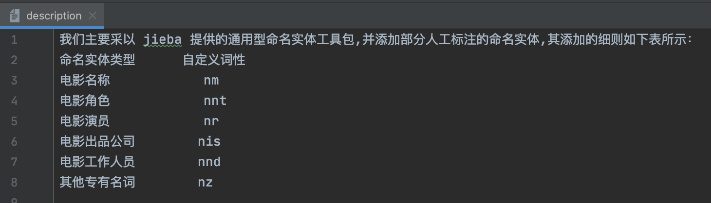
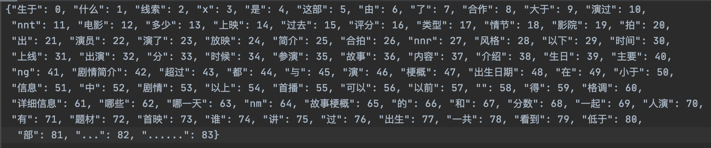
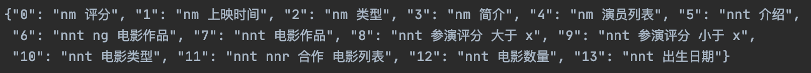
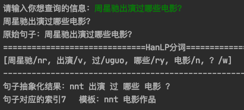

## 机器学习篇

#### 模型训练篇

1. 确定你问答中 用户提问的问题中的实体, 并给它**自定义词性**.

   比如所有的演员名字是一个类型的词性, 所有电影的名称是一个类型的词性等...

   后期需要添加对应的词和词性到分词器里面, 便于分词器能对不认识的词正常分词.

   

2. 将问答机器人可以提问的问题抽象为问题模板, 并为机器学习模型 人工**造训练数据**.

   比如某某电影的评分是多少, 有很多种问法, 这时需要将问题抽象化, 并列出来, 以此类推...

   问题类别越多, 类别里的内容越多, 问答机器人能回答的问题就越准确越详细.

   

3. 为当前 问题模板的所有数据分词并**生成Tokenzer**, 即将每一个词用数字来表示, 以便于送入机器学习模型计算.

   如果增加数据, 或更换数据, 需要重新生成该文件.

   

4. 为所有问题模板编写**问题答案查找**的一个字典文件, 用于最后查找对应类别问题的答案. 

   `注意,此处问题模板类别的顺序应和第2步中的问题顺序类别一致.`

   

5. 待`前两步`准备好后, 直接**执行 `~/MachineLearning/train.py`** 会自动生成第 3 步的文件, 第 4 步的文件需手动修改 `~/MachineLearning/train.py`里的字典才可生成正确的 dict

6. 运行完`train.py`因为数据量不大, 模型秒训练完毕.  直接**进入下一步使用阶段.**

#### 模型使用篇

```shell
python run analyze_question.py
```

输入你想要问的问题

得到问题分析结果, 如下图演示:



#### 模型优化篇

1. 添加问题模板的类别
2. 增加每个问题模板类别的内容
3. 为分词器添加 不常见词辅助分词: [词参考](https://github.com/Mrzhang3389/chatbot/tree/master/MachineLearning/participle_dict)
4. 为分词器添加 自定义词和词性
5. ......