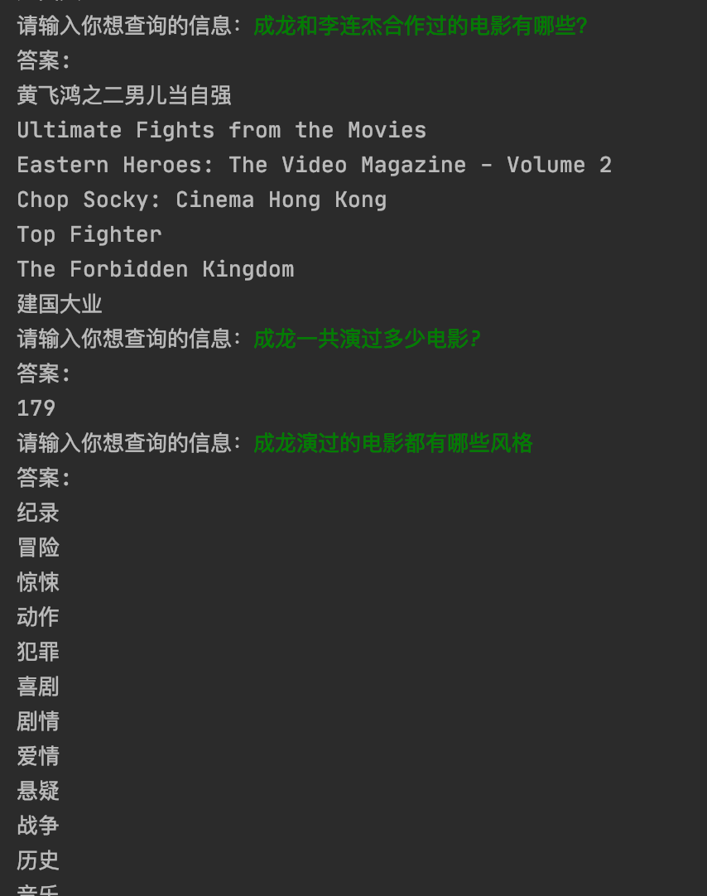
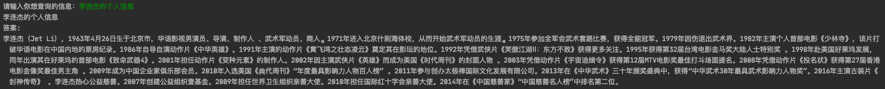
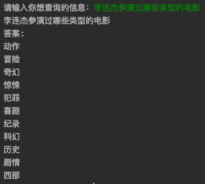

## 基于知识库问答的电影聊天机器人。

如果本项目对你学习构建一个聊天机器人有帮助, 欢迎 Start...

#### 效果图:

```bash
python chatbot.py
```







#### 如何构建

1. 先构建知识库参考[知识图谱](https://git.nosugar.io/nosugar-ailab/research/chatbot/-/tree/master/KnowledgeGraph)

2. 再构建问题处理模块参考[机器学习](https://git.nosugar.io/nosugar-ailab/research/chatbot/-/tree/master/MachineLearning)
3. 然后 问题处理模块 + 答案搜索模块 = 基于知识库的问答机器人
4. 最后优化模型中的细节和捕获异常