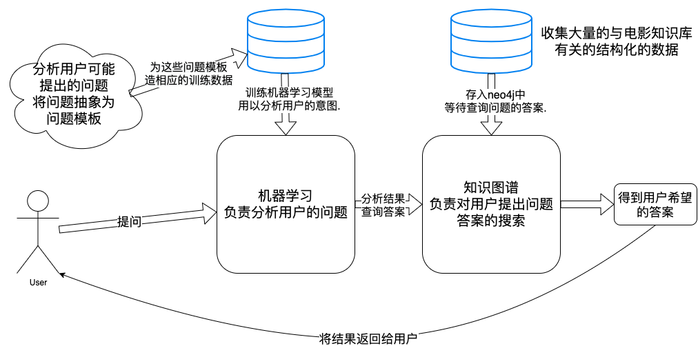

## 基于知识库问答的电影聊天机器人。

**如果本项目对你学习构建一个聊天机器人有帮助, 欢迎 Start...**

### 实现详细过程参考: [Chatbot](https://futurehear.github.io/chatbot/)

#### 整体思路


#### 环境搭建

```bash
pip install -r requirements.txt
```

#### 效果图:

```bash
python chatbot.py
```


