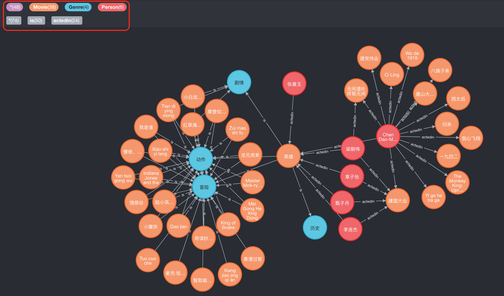

## 电影知识库问答机器人

### 最终效果

### 知识图谱篇

##### 准备工作

- 电影知识库的数据参考: [movie data](https://github.com/Mrzhang3389/chatbot/tree/master/KnowledgeGraph/movie_data)
- Neo4j图数据库
  - Neo4j官网: [Neo4j home](https://neo4j.com/)
  - Neo4j桌面版: [Neo4j Desktop](https://neo4j.com/download-center/#desktop)
  - Neo4j服务器版: [Neo4j Server](https://neo4j.com/download-center/#community)
  - Neo4j Docker版:  `docker pull neo4j`
- 简单的Neo4j语法知识: [Neo4j Cypher](https://neo4j.com/docs/cypher-refcard/current/)

##### 操作步骤

1. 运行你的Neo4j图数据库
2. 导入电影知识库数据: [数据导入](https://github.com/Mrzhang3389/chatbot/tree/master/KnowledgeGraph#%E4%BA%8C-%E5%AF%BC%E5%85%A5%E6%95%B0%E6%8D%AE)
3. 测试数据是否导入正常: [测试知识图谱](https://github.com/Mrzhang3389/chatbot/tree/master/KnowledgeGraph#%E4%B8%89-%E4%BD%BF%E7%94%A8%E6%95%B0%E6%8D%AE)

##### 知识图谱所达到的效果

### 机器学习篇

##### 准备工作

##### 操作步骤

##### 机器学习所达到的效果

### 机器学习训练模型以及优化篇

##### 准备工作

##### 操作步骤

##### ......