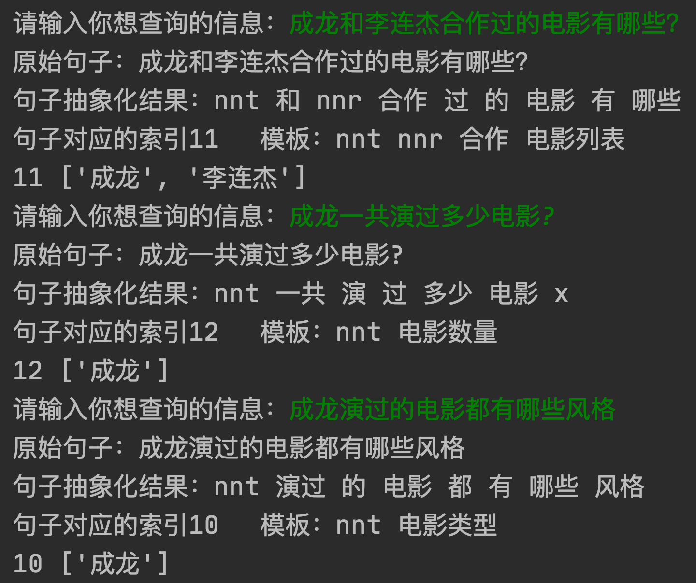

## 电影知识库问答机器人
## 最终效果


项目代码参考: [chatbot](https://github.com/Mrzhang3389/chatbot)

## 知识图谱篇

#### 为什么需要使用知识图谱

对原始数据流建立更加规范的数据表达，通过语义抽取、数据链接形成更多机器可理解的语义知识，从而将原本异构分散的各种数据转变为机器可计算的大数据。

将离散异构的数据通过图的方式链接成结构化的数据, 组成垂直领域的知识库,  用以对最后问题的答案查找.

#### 准备工作

- 电影知识库的数据参考: [movie data](https://github.com/Mrzhang3389/chatbot/tree/master/KnowledgeGraph/movie_data)
- Neo4j图数据库
  - Neo4j官网: [Neo4j home](https://neo4j.com/)
  - Neo4j桌面版: [Neo4j Desktop](https://neo4j.com/download-center/#desktop)
  - Neo4j服务器版: [Neo4j Server](https://neo4j.com/download-center/#community)
  - Neo4j Docker版:  `docker pull neo4j`
- 简单的Neo4j语法知识: [Neo4j Cypher](https://neo4j.com/docs/cypher-refcard/current/)

#### 操作步骤

1. 运行你的Neo4j图数据库
2. 导入电影知识库数据: [数据导入](https://github.com/Mrzhang3389/chatbot/tree/master/KnowledgeGraph#%E4%BA%8C-%E5%AF%BC%E5%85%A5%E6%95%B0%E6%8D%AE)
3. 测试数据是否导入正常: [测试知识图谱](https://github.com/Mrzhang3389/chatbot/tree/master/KnowledgeGraph#%E4%B8%89-%E4%BD%BF%E7%94%A8%E6%95%B0%E6%8D%AE)
4. 答案查找的Python代码参考: [答案搜索](https://github.com/Mrzhang3389/chatbot/blob/master/KnowledgeGraph/get_answer.py)

#### 知识图谱所达到的效果


## 机器学习篇

#### 为什么需要机器学习

通过机器学习对用户提出的问题, 进行问题模板分类, 关键时间 人名 地点 等词的抽取, 然后组成用户提问的真正意图, 最后在知识库中查找用户想得到的答案.

#### 准备工作

- 高斯朴素贝叶斯原理根据自身情况学习: [参考维基百科](https://zh.wikipedia.org/wiki/%E6%9C%B4%E7%B4%A0%E8%B4%9D%E5%8F%B6%E6%96%AF%E5%88%86%E7%B1%BB%E5%99%A8#%E9%AB%98%E6%96%AF%E5%96%AE%E7%B4%94%E8%B2%9D%E6%B0%8F)
- Python下scikit-learn包里面的naive_bayes的使用

#### 模型训练篇

1. 确定你问答中 用户提问的问题中的实体, 并给它**自定义词性**.

   比如所有的演员名字是一个类型的词性, 所有电影的名称是一个类型的词性等...

   后期需要添加对应的词和词性到分词器里面, 便于分词器能对不认识的词正常分词.

   

2. 将问答机器人可以提问的问题抽象为问题模板, 并为机器学习模型 人工**造训练数据**.

   比如某某电影的评分是多少, 有很多种问法, 这时需要将问题抽象化, 并列出来, 以此类推...

   问题类别越多, 类别里的内容越多, 问答机器人能回答的问题就越准确越详细.

   

3. 为当前 问题模板的所有数据分词并**生成Tokenzer**, 即将每一个词用数字来表示, 以便于送入机器学习模型计算.

   如果增加数据, 或更换数据, 需要重新生成该文件.

   

4. 为所有问题模板编写**问题答案查找**的一个字典文件, 用于最后查找对应类别问题的答案. 

   `注意,此处问题模板类别的顺序应和第2步中的问题顺序类别一致.`

   

5. 待`前两步`准备好后, 直接**执行 `~/MachineLearning/train.py`** 会自动生成第 3 步的文件, 第 4 步的文件需手动修改 `~/MachineLearning/train.py`里的字典才可生成正确的 dict, 训练问题分类模型: [训练代码参考](https://github.com/Mrzhang3389/chatbot/blob/master/MachineLearning/train.py)

6. 运行完`train.py`因为数据量不大, 模型秒训练完毕.  直接**进入下一步使用阶段.**  使用问题分类模型得到用户的意图:  [使用代码参考](https://github.com/Mrzhang3389/chatbot/blob/master/MachineLearning/analyze_question.py)

#### 模型使用篇

```shell
python run analyze_question.py
```

#### 机器学习模型效果:



#### 模型优化篇

1. 添加问题模板的类别
2. 增加每个问题模板类别的内容
3. 为分词器添加 不常见词辅助分词: [词参考](https://github.com/Mrzhang3389/chatbot/tree/master/MachineLearning/participle_dict)
4. 为分词器添加 自定义词和词性
5. ......

